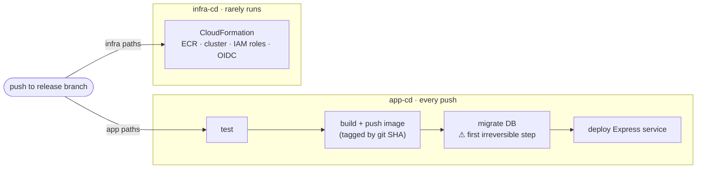

# Long-Running Server Deployment (ECS Express Mode)

Use this for a long-running server process — any runtime (Node, Python, Go, JVM) — that must
hold a **stable database connection pool** and avoid cold starts. It is the non-serverless
counterpart to the Lambda patterns.

The process runs as a container on **Amazon ECS Express Mode** (Fargate behind an ALB), the
managed-container successor to App Runner. Supply an image and IAM roles; ECS provisions the
load balancer, HTTPS listener, ACM certificate, target group, autoscaling, canary rollout, and
log group.

**Key rules:**

- **The compute is disposable; the data is durable.** The database, the secrets, and the image
  registry outlive any task. Nothing the app needs to survive lives in the container.
- **Two lifecycles, separately triggered.** CloudFormation owns durable infrastructure and runs
  on infra changes only; GitHub Actions ships images on every push. A slow, powerful stack
  update has no business running on a code change.
- **The Express service itself stays outside CloudFormation** — the deploy action
  create-or-updates it each push. This is what makes the compute disposable: a bad deploy cannot
  wedge a stack, and durable state survives any service replacement.
- **Order the pipeline reversible before irreversible.** Tests and the image push have no live
  effect; **the migration is the first irreversible action**, so it goes last, immediately before
  the service rolls. Every failure is then a clean failure with nothing half-applied.
- **Tag images by immutable git SHA**, and keep the last ~30 in an ECR lifecycle policy so the
  canary can roll back to the previous one.
- **Three principals, three ECS roles** — the *execution* role (the ECS agent: pull image, write
  logs, resolve secrets), the *task* role (your application code), and the *infrastructure* role
  (ECS, creating the ALB on your behalf). Execution and task are the pair most often wrongly
  collapsed into one: the agent needs secret reads the app must never have.
- **Two CI roles, deliberately disjoint.** The narrow *app* role is assumable only by pushes to
  the release branch and is the one that reads secrets. The powerful *infra* role runs
  CloudFormation, is assumable from pull requests for change-set previews, and can read no
  runtime secret. Neither is a superset of the other, so secret-reading credentials never exist
  in a PR context.
- **Secrets live in SSM SecureString, loaded out-of-band.** CloudFormation cannot create
  SecureString *values*. ECS resolves them at task start via the execution role, so **a running
  task keeps its old values** — changing a parameter does nothing until a new task starts.
- **TLS is two surfaces.** Inbound is free and automatic (ACM via Express Mode). Outbound to the
  database is not: managed-database CAs are absent from language trust stores, and this is the
  single most likely thing to break a fresh deploy.
- **The canary reverses; the database does not.** Migrations are forward-only, so keep them
  **expand/contract** — each change leaves the schema a superset the previous code tolerates:
  add a nullable column → ship code that uses it → drop the old column in a *later* deploy.
- **Health checks and test suites prove nothing about the database.** A health endpoint that
  deliberately never touches the database (so a transient blip cannot fail a deploy) and a suite
  running on an in-memory database both pass while production credentials are wrong.

See [REFERENCE.md](REFERENCE.md) for the ownership diagram, IAM and secrets wiring, the RDS CA
problem, container image requirements, the bootstrap order, and the deploy-cycle gotchas.

## Why a managed container

The deciding axis is **connection pooling**, not cost. A long-running process holds one stable
pool for its lifetime; serverless opens a pool per warm instance and storms the database, and
AWS's managed pooler (RDS Proxy) is VPC-only and unreachable from serverless hosting products.
That rules out serverless. What remains is *how* the long-running process runs:

| | ECS Express Mode — chosen | Self-managed EC2 | Serverless (Lambda / Amplify) |
|---|---|---|---|
| DB pooling | non-issue (stable pool) | non-issue (stable pool) | **problem** — a one-connection pool, or a self-hosted pooler |
| Cold starts | no | no | yes, on webhooks and interactive paths |
| TLS / ingress | ALB + ACM, included | DIY proxy + cert renewal | included |
| Ops burden | low (needs a Dockerfile + ECR) | **you own the box** | minimal |
| Resilience | health checks + autoscaling + canary auto-rollback | single point of failure | managed |
| Cost floor | **ALB ~$16/mo, always on** + task | cheapest on paper | cheap when idle |

EC2 is cheaper on paper, but the saving buys back OS patching, an on-box TLS proxy, a process
supervisor, and a bespoke deploy/rollback script. The ALB is an always-on floor that cannot idle
down — though up to 25 Express services in a VPC share one, making the floor **per-VPC, not
per-service**.

## Workflows

Two workflows, each one job with its own OIDC role — separate triggers and separate IAM scopes,
so an app deploy can never run infra changes. The names below are this document's convention;
`<infra>/` stands for wherever your templates live (`infra/`, `cdk/`, `terraform/`).

| Workflow | Trigger | Does |
|---|---|---|
| `app-cd` | push to the release branch, `paths-ignore: <infra>/**` + docs; and `workflow_dispatch` | test → build+push image → migrate → deploy service |
| `infra-cd` | PR / push to the release branch, `paths: <infra>/**` | validate; change-set **preview** on PR, execute on merge |

**The two path filters must be exact complements.** A path matching neither is deployed by
nothing; a path matching both triggers the race below.

Keep `workflow_dispatch` on `app-cd`: it is the only way to roll the service after a secret
change or an infra-only commit.

> **They race.** Separate concurrency groups mean the two run in parallel. When one push carries
> both an IAM change and app code, `app-cd` can reach the step needing the permission before
> `infra-cd` has applied it. Give them a shared concurrency group, make `app-cd` depend on
> `infra-cd`, or document the manual sequencing (let `infra-cd` land, then dispatch `app-cd`).
