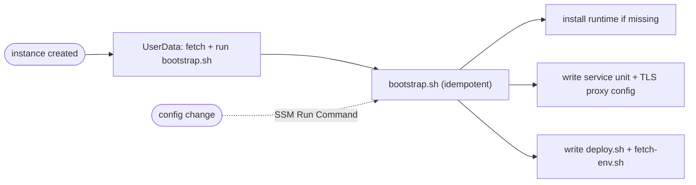
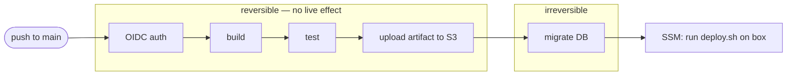
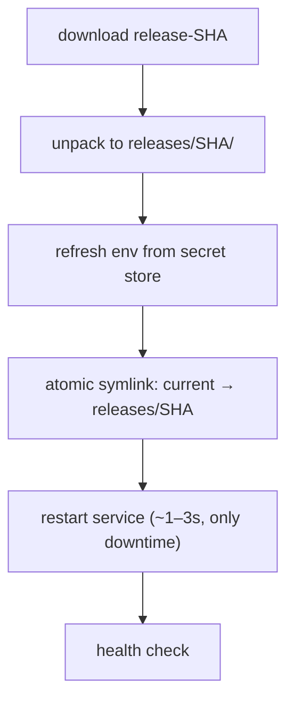
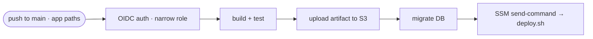
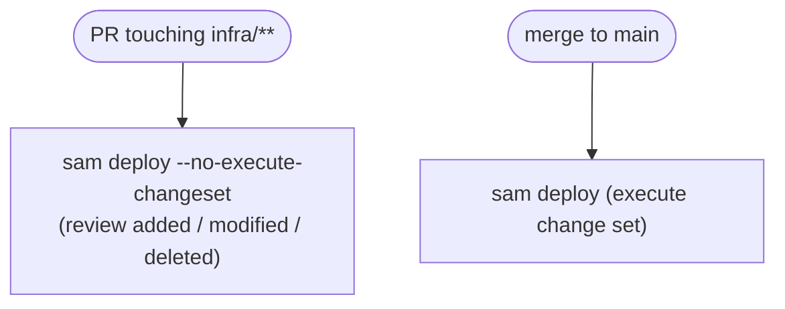
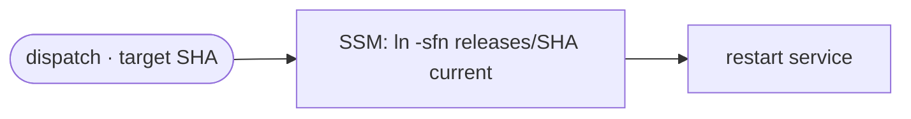
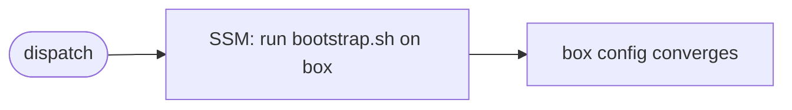

# Long-Running Server Deployment (EC2 + push-to-deploy CI/CD)

Use this for a **long-running server process on a single EC2 instance** — any runtime (Node,
Python, Go, JVM) — with automatic deploy on push. It is the non-serverless counterpart to the
Lambda patterns: reach for it when one process must hold a **stable database connection pool**
and avoid cold starts. Durable state lives off the box in a managed database (e.g. RDS); the
instance holds none.

## Two lifecycles — never mix them

The whole architecture rests on separating provisioning from deployment. Conflating them is the
usual mistake: a slow, powerful stack update has no business running on every code change.

| | Provision | Deploy |
|---|---|---|
| Runs | Once, or on infra change | Every push to `main` |
| Owner | CloudFormation / SAM | GitHub Actions |
| Does | Creates box, IAM, bucket, DB link | Ships new build onto the running box |

**Key rules:**
- **CloudFormation never runs on a code push.** A bad app deploy can't touch infrastructure; a
  code change never waits on a stack update.
- **Disposable box, durable data.** Compute is throwaway; the database, the secret store, and
  the Elastic IP (stable public address) all survive box replacement. Split into two stacks so
  the lifecycles are independent: a **data** stack (managed DB + its secret, long-lived) and a
  **compute** stack (EC2 + Elastic IP + IAM + artifact bucket) that imports the DB endpoint via
  `Fn::ImportValue`. Tear down and recreate compute freely.

## The box: a thin loader over an idempotent bootstrap

`UserData` runs **once at instance creation** and is a *replacement* property — editing it in
the template destroys and recreates the instance, and it never re-runs on an existing box. So
keep it a thin loader; put all real setup in a versioned, **idempotent** `bootstrap.sh` that can
be re-run any number of times to converge the box to the same state.

To change box config, edit `bootstrap.sh` and re-run it via **SSM Run Command** — the same
channel deploys use, so no box replacement and no stack update. A fresh box and a reconfigured
box then converge to identical state.

**Idempotency is the requirement** that makes re-running safe:

| Do (converges) | Not this (drifts) |
|---|---|
| install IF missing | install blindly |
| overwrite config wholesale | append to config |
| reload service only if changed | restart always |

## The deploy pipeline — reversible before irreversible

Order the pipeline so every cheap, reversible step passes before the first step that changes
live state. **The migration is the first irreversible action** — place it last, immediately
before the switchover, *after* the artifact is safely staged.

Migrating *before* upload would risk a moved-forward schema with no code to deploy if the upload
then failed; migrating *after* the switchover would run new schema against old code for longer
than the brief SSM window. On the box, `deploy.sh` performs an **atomic release swap** — the
only downtime is the service restart:

The symlink flip is atomic: `current` always points at a complete release, so there is no window
where the app runs half-old, half-new files. Everything before the restart happens while the old
version keeps serving.

## Identity — keyless

- **GitHub → AWS via OIDC**: the workflow exchanges a signed token for short-lived AWS creds,
  scoped to the repo and branch. No AWS keys stored in GitHub, no SSH key, no open SSH port.
- **The box uses its instance role** for `s3:GetObject` (artifacts) and secret reads, each scoped
  to its own path.
- **Secrets live only in the secret store** (SSM Parameter Store / Secrets Manager) — never in
  the template, git, or GitHub. `fetch-env.sh` reads them into an environment file the service
  loads at start.

## Rollback — deploy reverses, the database does not

- **Deploy rollback is instant**: re-point `current` to the previous `releases/<sha>` and
  restart. No rebuild.
- **The DB does not roll back.** Migrations are forward-only; reversing one risks deleting real
  data mid-incident. Make code rollback *safe* instead with **expand/contract** migrations —
  each change leaves the schema a superset the previous code tolerates: add a nullable column →
  ship code that uses it → drop the old column in a *later* deploy. Never pair a destructive
  migration with rollback-eligible code; snapshot the DB before a true-destructive change.

## GitHub Actions workflows

Four workflows, each with a single job. Keep them separate — different triggers, different IAM
scopes — so least privilege holds and an app deploy can never run infra changes.

| Workflow | Trigger | Does |
|---|---|---|
| `app-cd` | push to `main`, app paths | build → test → upload → migrate → SSM deploy |
| `infra-cd` | PR / push to `main`, `infra/**` paths | change-set preview on PR, execute on merge |
| `rollback` | manual dispatch (`workflow_dispatch`) | re-point `current` to a prior release |
| `reconfigure-box` | manual dispatch | re-run `bootstrap.sh` on the box via SSM |

**`app-cd`** — the everyday path. Uses a *narrow* role (upload artifact, send SSM command, reach
the DB to migrate):

**`infra-cd`** — path-filtered to infra files. A *powerful* role (CloudFormation + IAM +
EC2/DB), gated behind a change-set preview so a template typo can't silently replace the box or
drop the database:

**`rollback`** — manual, parameterised by target SHA. No rebuild, no migration; pure symlink flip
via SSM:

**`reconfigure-box`** — manual button to apply box-config changes (new service unit, proxy
config) without replacing the instance, by re-running the idempotent bootstrap:

