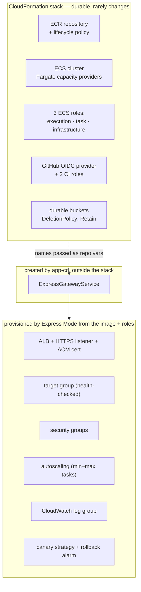
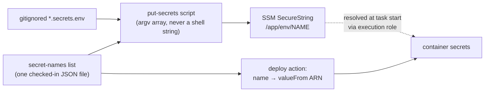
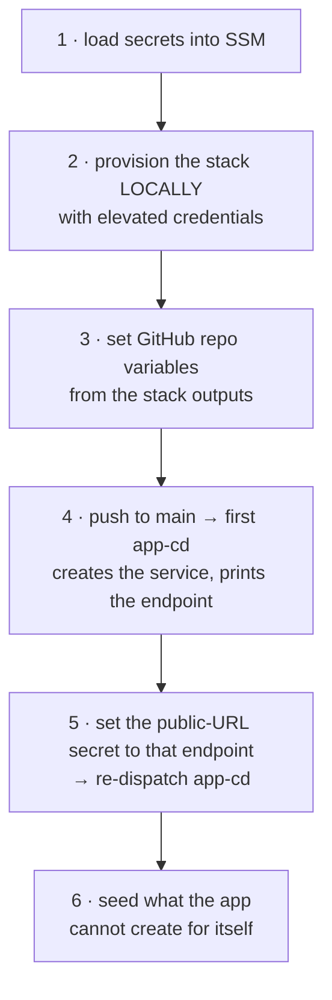

# Deployment Reference

Detail behind [DEPLOYMENT_ARCHITECTURE.md](DEPLOYMENT_ARCHITECTURE.md).

## Who owns what



The database sits in a **separate lifecycle** and is not created by this stack — that separation
is what keeps compute throwaway. Co-locating the database with the compute reunites them and
makes one task a single point of failure for both the app and every record.

## IAM

### The three ECS roles

| Role | Assumed by | Exists to |
|---|---|---|
| **Execution** | the ECS agent (`ecs-tasks`) | pull the image, write logs, resolve SSM SecureStrings at task start |
| **Task** | your **application code** (`ecs-tasks`) | whatever AWS the app itself calls — scoped to exactly that |
| **Infrastructure** | the ECS service (`ecs.amazonaws.com`) | let Express Mode create the ALB, target groups, cert, and autoscaling |

The SDK picks the task role up from the container credential endpoint with no configuration,
which is why **no key material exists anywhere in the app**.

### The two OIDC CI roles

Pin the trust conditions to the exact subject:

| Role | `token.actions.githubusercontent.com:sub` | Grants |
|---|---|---|
| **app** | `repo:<owner>/<repo>:ref:refs/heads/<branch>` | ECR push, deploy the service, `PassRole` the three ECS roles, read `DATABASE_URL` |
| **infra** | the same, **plus** `repo:<owner>/<repo>:pull_request` | CloudFormation, IAM, ECR, ECS — and no SSM read |

Scope every secret read to the environment's SSM prefix, and grant `kms:Decrypt` only under a
`kms:ViaService: ssm.<region>.amazonaws.com` condition.

The deploy action's ECS permissions must include the **read** verbs that let it *watch* a
rollout it already has permission to *create* — `ecs:ListServiceDeployments`,
`DescribeServiceDeployments`, `DescribeServiceRevisions`. The Express service is created on the
fly and has no ARN before it exists, so its resource is `*`, bounded by how narrow the role is.

## Secrets



- **One list, two consumers.** Keep the secret *names* in a single JSON file read by both the
  put-secrets script and the deploy action, so SSM and the container mapping cannot drift.
  Adding a secret becomes a one-file edit.
- **Pass values as an argv array** (e.g. `execFileSync`), so a password with shell
  metacharacters is never interpolated into a command string.
- **Skip empty values with a warning**, so a partial run leaves an existing secret intact.
- **Configuration is not a secret.** Bucket names and regions are plain environment variables.
  Set `AWS_REGION` explicitly — ECS does not, and the SDK has no other way to resolve a region
  inside Fargate.

## The outbound TLS problem

Managed databases present a certificate signed by an **Amazon RDS intermediate CA that language
runtimes do not ship**. Modern drivers verify the chain, so without that CA every connection
dies at the handshake with `UNABLE_TO_GET_ISSUER_CERT_LOCALLY`.

*Postgres and Node are shown below; the failure is the same on any engine and runtime, but the
DSN keyword, the trust-store knob, and the error strings differ.*

- **Commit the CA bundle.** It is public certificates with no private key material. A trust
  anchor should be pinned and reviewable rather than fetched at build time from whatever an
  endpoint happens to serve. It does not auto-update — put a refresh on the calendar.
- **Point the runtime at it in two places that must stay in lockstep**: the image (for the
  running container) and the **migrate step** in CI. When CI reaches the database but the
  container cannot, this is the first place to look.
- Prefer a trust-store *append* (e.g. `NODE_EXTRA_CA_CERTS`) over passing a CA path in code:
  bundlers make repo-relative runtime reads fragile, and local dev stays untouched.
- **Say `sslmode=verify-full` explicitly.** Some drivers treat `require` as verify-full today but
  will revert to libpq's *unverified* semantics in a future major, silently downgrading to a
  connection an active MITM could intercept.
- **Verify a bundle against the endpoint the app actually connects to**, hostname included —
  that is half of what verify-full enforces:

  ```bash
  openssl s_client -starttls postgres -connect <endpoint>:5432 \
    -CAfile <bundle>.pem -verify_hostname <endpoint> </dev/null
  # expect: Verify return code: 0 (ok)
  ```

  For Aurora the certificate carries the **instance** name in its CN, with cluster and reader
  endpoints only as subject alternative names.

## Container image

- **Build `--platform linux/amd64`** and pin the base image by digest. Fargate defaults to
  LINUX/X86_64; a musl base (alpine) or arm64 fails to load prebuilt glibc/x64 native binaries.
- The container port, the deploy action's `container-port`, and the health-check path must all
  agree.
- Run as an unprivileged user, and ship only the build output on a bare runtime base.

## Standing it up

Two chicken-and-eggs force the order.



1. **Secrets first** — the execution role is scoped to the SSM prefix, and provisioning prints
   guidance assuming the parameters exist.
2. **The first `sam deploy` runs locally with elevated credentials.** *(Chicken-and-egg #1: the
   OIDC deploy role does not exist until the stack creates it, so CI cannot bootstrap itself.)*
   Grant a human exactly the infra role's policy for the one-time provision, then detach it.
   Afterwards `infra-cd` owns every change.
3. **Repo variables are non-secret identifiers only** — role ARNs, ECR URI, cluster name, the
   three ECS role ARNs, region, SSM prefix, service name, subnets. Have the provision script
   print them verbatim from the stack outputs.
4. **The public URL does not exist until the service does.** *(Chicken-and-egg #2.)* Anything
   needing its own external URL — session and cookie libraries behind an ALB are the classic
   case — starts as a placeholder and is corrected in step 5, which requires a **re-roll**, not
   just a parameter write.
5. **Seed what the app cannot create for itself.** Migrations leave a fresh database with schema
   and no rows. Where there is no self-service path to the first record — an app with no sign-up
   route still needs its first admin — a seed is the only way in. Make it **idempotent**, so
   re-running it never resets an existing credential.

**Network prerequisite:** at least **two public subnets in at least two AZs**, in the **same VPC
as the database**. Express Mode spreads the ALB across the AZs and gives tasks public IPs. Pick
subnets in the database's VPC, or the migrate step cannot reach it.

**Confirm the deployer's permissions with a real change set.** `iam:SimulatePrincipalPolicy` is
the clean check and is itself often denied. Creating a change set against the real template and
deleting it exercises the true permission set. Probing individual actions with
deliberately-invalid arguments tests the *action* but not the *resource ARN* it is evaluated
against, and gives false confidence.

## Gotchas that cost a deploy cycle

| Symptom | Cause |
|---|---|
| `CreateChangeSet` denied on `aws:transform/Serverless-2016-10-09` | Declaring `Transform: AWS::Serverless-2016-10-09` authorizes against a **second, AWS-owned** ARN that account-scoped policies don't cover. With no `AWS::Serverless::*` resources in the template, **drop the transform** — `sam deploy` handles a transform-free template fine. |
| Deploy succeeds in AWS but the workflow hangs, then fails | The deploy action lacks the read permissions to watch the rollout, so it polls on `AccessDenied` until timeout. Look for `Service created successfully` above the warnings and confirm with `aws ecs describe-services`. |
| Migrate step fails instantly with no useful error | Migration CLIs often let a spinner swallow the driver exception. **Timing is the tell**: a sub-second failure is fail-at-connect (TLS, credentials, wrong database); a security-group or routing problem takes seconds to minutes. Reproduce with a plain driver client to get the real error code. |
| cfn-lint flags valid `ecs:*ExpressGatewayService` actions | Its bundled IAM catalogue predates Express Mode. Suppress on the resource via `Metadata: cfn-lint: config: ignore_checks: [W3037]`. Older AWS CLI builds likewise lack the `*-express-gateway-service` subcommands. |
| Everything green, but the app cannot reach the database | Test the real connection before pushing, with a throwaway credential against the real endpoint. An **auth** rejection (Postgres `28P01`) is the result you want: it proves TLS, networking, and the security group are all fine. A **TLS** error means the trust chain is wrong. |

## Teardown and break-glass

The service lives outside the stack, so delete it **first** — a cluster cannot be removed while
a service runs in it:

```bash
aws ecs delete-express-gateway-service --service <name> --cluster <cluster>
sam delete --stack-name <stack>
```

Neither step removes the SSM parameters or the database. Give durable buckets
`DeletionPolicy: Retain` so a `sam delete` typo cannot take records with it.

**There is no shell to SSH into** — the point of a managed platform, but it changes
incident-response habits. Debug with `aws ecs describe-services` /
`describe-express-gateway-service`, the CloudWatch log group, and ECS Exec if enabled.

## Usually forgotten

- **Database ingress.** Once the service exists it has its own security group. Allow the database
  port **from that group**, then drop any `0.0.0.0/0` rules. Sequence matters: add the narrow
  rule and confirm the app works *before* removing the broad ones.
- **A second environment.** Parameterise stack name, SSM prefix, and service name from the start;
  standing up staging later is then a parameter change rather than a rewrite.
- **Log retention.** Express Mode creates the log group with default retention.
