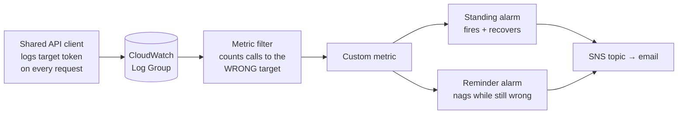

# Environment Target Guard

Use this whenever a service picks **which environment of an external system to call**
from configuration — a staging store and a production store, a sandbox API and a live
API, a test tenant and a real tenant.

Picking wrong is the failure that does not announce itself. The call succeeds. There
is no exception, no dead-letter message, no error alarm. Real customer data lands in
the wrong environment and every dashboard stays green until someone notices by hand,
which can take days.

**The rule: guard the running code, not the configuration.**

Watching the configuration is the instinct, and it cannot work: Lambda environment
variables are absent from the configuration AWS Config records and omitted from
CloudTrail. The effective target has to be logged by the code that uses it.

## The pattern



Each guarded function gets its own log group, metric filter, metric and alarms. The
guard declares the target it **expects**; the filter hunts for every other one.

## Key rules

- **Log the token in the shared client's request path**, once, not in each handler.
  Override `request` (or equivalent) on the client that already knows the target, so
  every present and future caller is covered with no per-handler work and nothing to
  remember.
- **Log per request, not per client.** Clients are usually built at module import, so
  a per-client line stops appearing while a warm execution environment keeps sending
  traffic — and the alarm reports a recovery that never happened.
- **Match a token you own** (`target=staging`), not the external hostname. Hostnames
  change without you, and a filter that matches nothing is indistinguishable from a
  filter that finds nothing wrong. A token also cannot be echoed back by the data:
  a metric filter matches *any* line in the group, and handlers that log request
  payloads or response bodies will eventually log a URL.
- **Put the expected target beside the configured one**, in the same template, so one
  diff shows both and they cannot drift apart.
- **Set `DefaultValue: 0`** on the metric transformation. Without it the metric goes
  blank rather than zero, the alarm sits in `INSUFFICIENT_DATA` instead of `OK`, and
  the recovery notification never arrives.
- **Give the metric no dimensions.** CloudWatch forbids a default value on a metric
  filter that assigns dimensions, and the default value is not optional. So use one
  metric name per guarded function. Never dimension by a high-cardinality field such
  as an order or customer id: CloudWatch bills per unique metric, and a per-record
  dimension turns a log line you already have into a four-figure monthly bill.
- **Hold the alarm through traffic gaps.** Event-driven traffic is bursty. A
  one-period window flips to `ALARM` on a bad minute and back to `OK` on the next
  quiet one, mailing a recovery that is a lie. Use a wide window with
  `DatapointsToAlarm: 1` so a single bad period holds the alarm, and returning to `OK`
  requires the whole window clean.
- **Let CloudFormation own the log group.** `AWS::Logs::MetricFilter` requires the
  group to already exist, and a Lambda-created group does not appear until the first
  invocation — so the first deploy of a new function fails. Declare
  `AWS::Logs::LogGroup` and point the function's `LoggingConfig` at it.
- **Do not name the log group, the filter or the alarms.** An explicit physical name
  turns any future replacement into a failed deploy, because CloudFormation creates
  the replacement before deleting the original.
- **Guard every function that builds the client.** Put a directive note at the top of
  the template's resource section saying so. A new function without a guard inherits
  the original silent failure, and nothing in CI or CloudFormation will complain.

The complete nested stack is
[`templates/environment-target-guard.yml`](templates/environment-target-guard.yml).
See [REFERENCE.md](REFERENCE.md) for the client hook that emits the token, and for how
the guard composes with a queue-triggered function template.

## The reminder alarm

A CloudWatch alarm notifies on a **state change**, so a standing alarm mails once and
then holds quietly for as long as the fault lasts. A second alarm re-mails on a clock.

Build it with metric math, not a scheduled Lambda — but **do not copy a queue-depth
reminder verbatim**. Queue depth is a **level**: non-zero continuously while broken,
so any clock tick observes it. Wrong-target calls are a **rate**: zero in every period
that simply had no traffic. Widen the period so a real fault cannot hide in a gap —
an hourly `Sum` asks "did anything at all go to the wrong target this hour", which a
live fault cannot dodge. A period with no data means nothing was processed, so nothing
went anywhere: treat missing as not breaching.

Give the reminder **no OK actions**. It returns to `OK` at the end of every cycle by
design; the standing alarm owns the recovery notification.

## The intentional flip

Moving a service to a different target on purpose **will** trip its own guard, and no
ordering avoids it. The configured value and the metric filter are two resources and
CloudFormation cannot change them in the same instant:

- Filter first: it hunts the new wrong target while the function still logs the old
  one. Fires.
- Function first: it logs the new target while the old filter is still hunting it.
  Fires.

Expect one alert and one recovery per deliberate flip, and say so where the runbook
lives. Adding a mute parameter is possible, but an alarm anyone can switch off is an
alarm someone leaves off — prefer the noise.

## Testing the guard

An alarm nobody has ever seen fire is a guess. Test it two ways: the first proves the
mechanism costs nothing and touches nothing, the second proves the real wiring.

### 1. Rehearse from the CLI

A metric filter watches a log group and does not care what wrote the lines, so the
whole chain runs on fake lines with no function at all. Give the alarm **no actions**
so nobody is mailed, and use a short window so the round trip finishes while you
watch.

```bash
LG=/test/env-guard-rehearsal
aws logs create-log-group  --log-group-name $LG
aws logs create-log-stream --log-group-name $LG --log-stream-name t1

aws logs put-metric-filter --log-group-name $LG --filter-name wrong-target \
  --filter-pattern '"target=staging"' \
  --metric-transformations metricName=RehearsalWrongTarget,metricNamespace=Rehearsal,metricValue=1,defaultValue=0

aws cloudwatch put-metric-alarm --alarm-name env-guard-rehearsal \
  --namespace Rehearsal --metric-name RehearsalWrongTarget \
  --statistic Sum --period 60 --evaluation-periods 2 --datapoints-to-alarm 1 \
  --threshold 0 --comparison-operator GreaterThanThreshold \
  --treat-missing-data notBreaching

# The JSON form is required: the shorthand parser breaks on a realistic log line.
aws logs put-log-events --log-group-name $LG --log-stream-name t1 \
  --log-events "[{\"timestamp\": $(date +%s000), \"message\": \"[INFO] [record_id:1234] target=staging\"}]"

aws cloudwatch describe-alarms --alarm-names env-guard-rehearsal \
  --query 'MetricAlarms[0].StateValue' --output text
```

Watch it reach `ALARM`, stop writing lines, watch it return to `OK`, then tear down:

```bash
aws cloudwatch delete-alarms --alarm-names env-guard-rehearsal
aws logs delete-log-group --log-group-name $LG
```

Deleting the log group removes its metric filter too. The custom metric name lingers
in the console — CloudWatch offers no way to delete a metric — and ages out on its own.

Two behaviours to expect, and to write into your own runbook once measured:

```
t+0s     wrong-target line written
t+~75s   OK -> ALARM                     detection is fast
t+~6min  ALARM -> OK  (2-period window)  recovery lags well behind the window
```

Recovery takes noticeably longer than the period arithmetic suggests. Read a wide
production window as "about that long", never as exact.

### 2. Rehearse for real, with a canary

The CLI test never touches the guard you shipped or the topic it mails. A **canary**
does: a function whose only job is to be pointed at the wrong target on purpose.

- No trigger, nothing depends on it, invoked by hand.
- It makes **one read-only call** — a lookup for an identifier that cannot exist. The
  call is required: building the client logs nothing, and only the request path writes
  the token the filter counts.
- It reads the target **inside the handler**, not at import, so a value changed in the
  console takes effect on the very next invoke.
- Its guard expects the safe target, so it ships silent.
- Set its reminder interval to off. A test fixture must never nag the alert list daily.

The run:

1. Change its target variable to the wrong value.
2. Invoke it. Its response should echo the target it hit.
3. The alert list gets mail within a couple of minutes.
4. Change it back. The alarm clears itself after the hold window and mails the
   recovery.
5. Revert the canary as its own commit, so removing it is one `git revert`.

Commit the canary separately from the guard for exactly that reason.

### What a fresh deploy looks like

A brand-new alarm starts in `INSUFFICIENT_DATA`, not `OK`. As soon as it has data it
moves to `OK`, and that transition fires the OK action — so **creating N guards mails
N "recovered" notifications** for something that was never wrong. Expect it once per
alarm at creation, tell the recipients in advance, and know it does not repeat on
ordinary redeploys, because an alarm already in `OK` never changes state.
