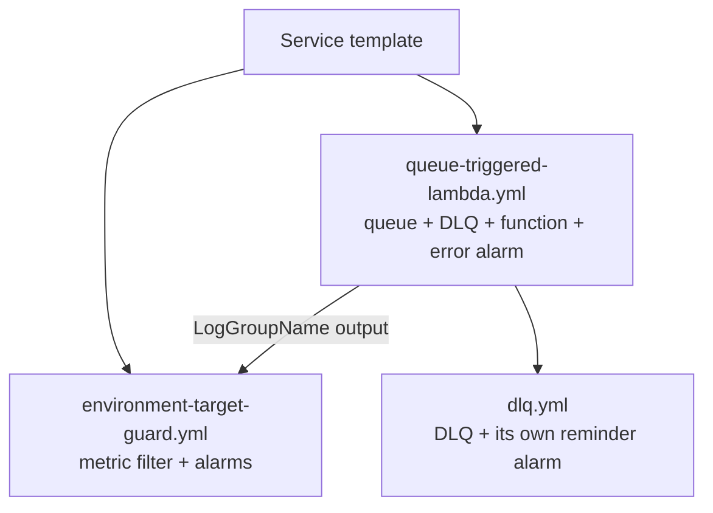
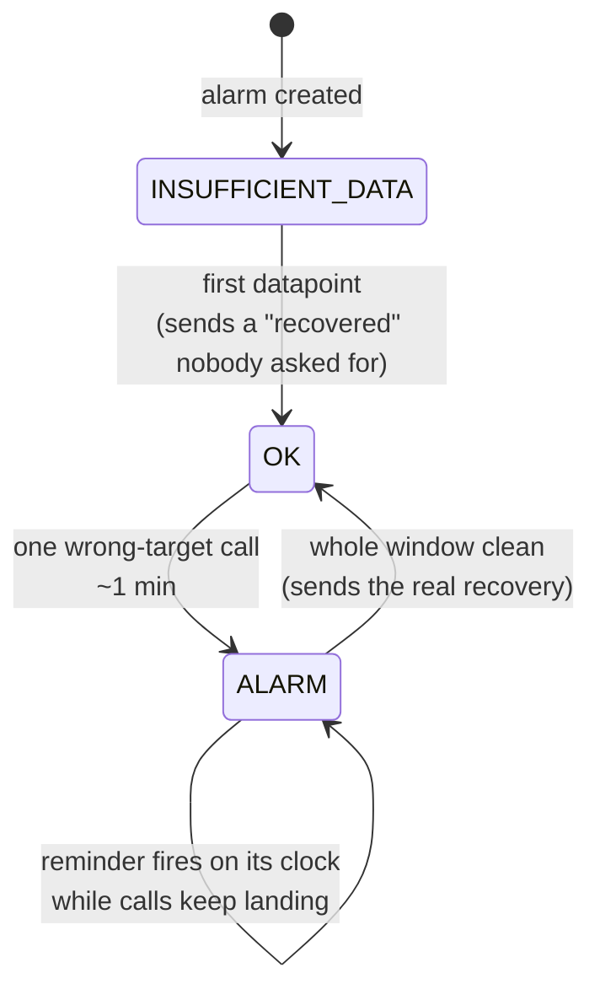

# Environment Target Guard — Reference

Snippets and composition notes for [ENVIRONMENT_GUARD_ARCHITECTURE.md](ENVIRONMENT_GUARD_ARCHITECTURE.md).

## The guard itself

[`templates/environment-target-guard.yml`](templates/environment-target-guard.yml) is
the complete nested stack: metric filter, standing alarm, reminder alarm, and the
mapping the reminder's clock reads. Copy it into your shared templates directory and
instantiate it once per guarded function.

Every decision it encodes is written in its own comments, next to the property it
explains — the evaluation window, the hourly reminder period, the mapping rows that
must exist even though nothing reads them. Read those before changing a number.

The only value a caller has to get right is `ExpectedTarget`. Two things to adapt to
your codebase:

- the token text in `FilterPattern`, which must match what your client logs
- `MetricNamespace`, if `EnvironmentGuard` collides with something you already use

## Where the token comes from

The client already knows the target: it turned the configured value into a base URL.
Override its request path so every caller is covered by one edit.

```python
class ExternalApi(ApiBase):
    def __init__(self, *, token: str, target: Target = "production") -> None:
        base_url = STAGING_URL if target == "staging" else PRODUCTION_URL
        super().__init__(base_url=base_url)
        self.target = target

    def request(self, *, method: str, endpoint: str, **kwargs: Any) -> Response:
        """Log which environment this call targets, then send it.

        The target is fixed when the client is built and never appears in the
        request, so this line is the only runtime record of it. A metric filter
        watches for the wrong value. Change the token text and that filter
        silently stops matching, which looks exactly like everything being fine.

        Per request, not once per client: clients are built at module import, so a
        per-client line would stop appearing while a warm execution environment
        kept sending traffic, and the alarm would report a recovery that had not
        happened.
        """
        logger.info("target=%s", self.target)
        return super().request(method=method, endpoint=endpoint, **kwargs)
```

If the caller already wraps work in a logging scope carrying a record identifier, that
prefix rides along free, and the log becomes the list of exactly which records went to
the wrong environment.

## Composition

The guard is deliberately small and takes a log group as a parameter, so it composes
with whatever creates the function rather than replacing it. Three nested stacks stack
up into one guarded, queue-triggered handler:



`queue-triggered-lambda.yml` and `dlq.yml` ship with the `aws-best-practices` skill.
Adding the guard to a function built that way is two lines in the caller plus one
nested stack:

```yaml
  MyHandlerStack:
    Type: AWS::Serverless::Application
    Properties:
      Location: ../shared/templates/queue-triggered-lambda.yml
      Parameters:
        # ...
        ManageLogGroup: "true"        # the guard needs a log group that exists at deploy time

  MyHandlerGuard:
    Type: AWS::Serverless::Application
    Properties:
      Location: ../shared/templates/environment-target-guard.yml
      Parameters:
        ResourceName: !Sub "${AWS::StackName}-my-handler"
        LogGroupName: !GetAtt MyHandlerStack.Outputs.LogGroupName
        ExpectedTarget: production
        AlarmSNSTopicArn: !ImportValue ...
```

`!GetAtt ...Outputs.LogGroupName` does double duty: it passes the name **and** makes
the handler stack a dependency, so CloudFormation always creates the log group before
the filter that attaches to it. No `DependsOn` needed.

Two payoffs worth naming. The guard never has to know how the function was built, so
the same nested stack covers queue-triggered handlers, plain functions and anything
added later. And because the reminder alarm reads the same style of clock as
`dlq.yml`, anchoring both on the same UTC hours means a stack running several
reminders sends them together instead of at unrelated times.

## Adding the log group to a shared function template

A function template that other services already use should gain the log group behind
an off-by-default switch, so existing callers are untouched:

```yaml
Parameters:
  ManageLogGroup:
    Type: String
    AllowedValues: ["true", "false"]
    Default: "false"

Conditions:
  CreateLogGroup: !Equals [!Ref ManageLogGroup, "true"]

Resources:
  ProcessorLogGroup:
    Type: AWS::Logs::LogGroup
    Condition: CreateLogGroup
    Properties:
      RetentionInDays: !Ref LogRetentionInDays   # no LogGroupName — see the naming rule

  ProcessorFunction:
    Type: AWS::Serverless::Function
    Properties:
      # Ref returns the group's name and makes it a dependency, so CloudFormation
      # creates the group before the function that writes to it.
      LoggingConfig: !If
        - CreateLogGroup
        - LogGroup: !Ref ProcessorLogGroup
        - !Ref AWS::NoValue

Outputs:
  LogGroupName:
    Condition: CreateLogGroup
    Value: !Ref ProcessorLogGroup
```

Three things that bite here:

- A custom log group name must not begin with `aws/`. Lambda cannot create such a
  group, and the function's logs then silently never arrive. Leaving the group unnamed
  sidesteps this entirely.
- `AWSLambdaBasicExecutionRole` grants logs on `Resource: "*"`, not on
  `/aws/lambda/*`, so a group outside that prefix needs no extra IAM.
- Repointing an existing function leaves its old group and history in place; it just
  stops receiving new lines. Recovery queries must target the new group.

## Alarm states over an incident



## Recovering the affected records

The guard says something is wrong. The log says exactly what went where. With the
record identifier in the logging prefix:

```
fields @timestamp, @message
| filter @message like "target=staging"
| parse @message "[record_id:*]" as record_id
| sort @timestamp desc
| limit 1000
```

Metric filters are not retroactive — they only see lines written after the filter
exists — but the log lines themselves predate the guard if the client was already
logging the token. Check the retention on the group before promising a date range.
