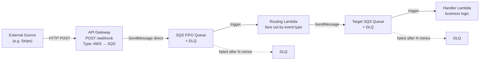
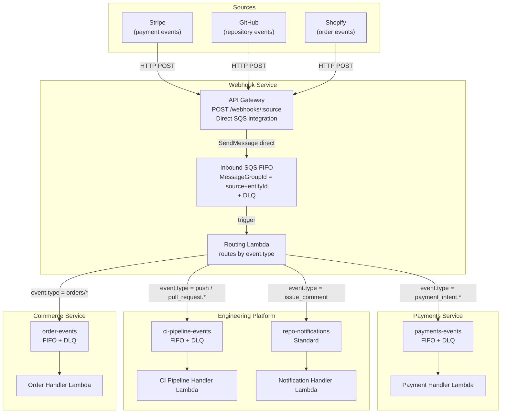

# AWS Webhook Architecture — Reference

## Why Direct API GW → SQS (No Ingest Lambda)

An ingest lambda between API GW and the first queue introduces failure modes that direct integration avoids:

| Risk | Ingest Lambda | Direct Integration |
|---|---|---|
| Lambda cold start delays source | Yes | No |
| Lambda crash drops payload | Yes — payload gone | No — API GW retries |
| Lambda timeout under burst load | Yes | No — SQS absorbs burst |

Direct integration is transactional: API GW either gets a `200` from SQS or a `5xx` it can retry. The source always receives a fast `200`.

---

## Simple Data Flow

Single source, single payload type, ordered delivery.



**What each layer does:**

| Layer | Responsibility |
|---|---|
| API GW | TLS termination, auth (API key / IAM), rate limiting, direct SQS write |
| FIFO Queue | Buffers bursts; preserves order via `MessageGroupId`; DLQ on failure |
| Routing Lambda | Reads `event.type`, dispatches to the correct downstream queue |
| Target Queue | Decouples routing from business logic; retries independently |
| Handler Lambda | Contains all domain logic for one payload type |
| DLQ | Catches poison messages; redriven manually or via `start-message-move-task` |

---

## Complex Data Flow — Microservices

Multiple sources, multiple event types, multiple microservices, ordering preserved per entity.



---

## API GW → SQS Direct Integration

Configure the API GW method with `Type: AWS` and target `sqs:path/{AccountId}/{QueueName}`. Key settings:

- `Credentials` — IAM role granting `sqs:SendMessage` on the target queue
- `RequestTemplates` — transform the JSON body to `application/x-www-form-urlencoded` with `Action=SendMessage&MessageBody=...&MessageGroupId=...`
- `PassthroughBehavior: NEVER` — reject requests that don't match the content-type mapping
- `IntegrationResponses` — map the SQS `200` back to the caller immediately; no processing delay

---

## SQS FIFO Queue + DLQ

Key properties to set:

- `FifoQueue: true` — enables ordering and exactly-once processing
- `ContentBasedDeduplication` — see below
- `RedrivePolicy.maxReceiveCount` — how many delivery attempts before parking in DLQ (typically 3–5)
- DLQ `MessageRetentionPeriod` — set to 14 days to give time to investigate and redrive

**Redrive:** use the SQS console "Start DLQ redrive" or the `aws sqs start-message-move-task` CLI command.

**CloudWatch Alarm — required on every DLQ.** Create a `NumberOfMessagesSent` alarm on each DLQ so failures surface immediately rather than sitting silently. Key settings:

- Metric: `NumberOfMessagesSent` on the DLQ (not `ApproximateNumberOfMessagesVisible` — that only reflects what's already there, not new arrivals)
- Threshold: `>= 1` — any message landing in a DLQ is a failure worth alerting on
- Evaluation period: 1 minute, 1 data point to breach — fail fast
- Action: notify an SNS topic (email, PagerDuty, Slack) so the team can investigate and redrive promptly

---

## FIFO Queue — Key Decisions

### MessageGroupId

Controls ordering scope. Events in the same group are processed sequentially.

| Use case | MessageGroupId |
|---|---|
| All events of a type in global order | `"default"` |
| Per-customer ordering | `customer.id` |
| Per-order ordering | `order.id` |

Using `"default"` serialises all events through one consumer — safe but limits throughput to one concurrent consumer per group.
Using an entity ID parallelises across entities while keeping per-entity order.

### ContentBasedDeduplication

Choose based on your deduplication requirements. When enabled, SQS computes the dedup ID from the message body — no `MessageDeduplicationId` needed at the API GW layer.

| Setting | When to use | Example |
|---|---|---|
| `true` | The webhook source retries on failure — the same payload arriving twice within 5 minutes should be suppressed | Stripe retries failed deliveries for up to 3 days; an identical body means the same event → suppress the duplicate automatically |
| `false` | The same body can legitimately represent a new event — e.g. boolean state that oscillates | An IoT sensor fires `{"device_id": "sensor-01", "alert": true}` when temperature spikes. After the alert is acknowledged and cleared, it can spike again minutes later — identical body, genuine second event that must process. Pass a unique alert ID as `MessageDeduplicationId` so both deliveries go through |

**Default to `true` for inbound webhook queues.** Switch to `false` when the same payload body can recur legitimately within the 5-minute dedup window, and pass the source's own event or alert ID as `MessageDeduplicationId` to control deduplication explicitly.

---

## Scaling — Adding a New Payload Type

```
1. Create a new SQS queue + DLQ
2. Pass the queue URL as an env var to the routing lambda
3. Add an entry to the routing map for the new event.type
4. Create a handler lambda subscribed to the new queue
5. Deploy — no API GW changes needed
```
